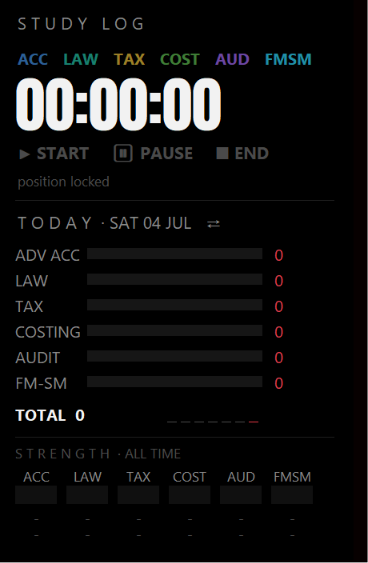
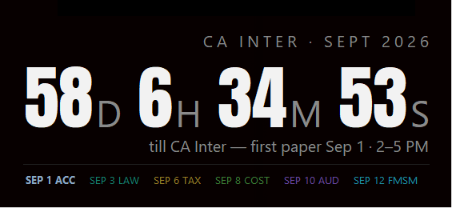
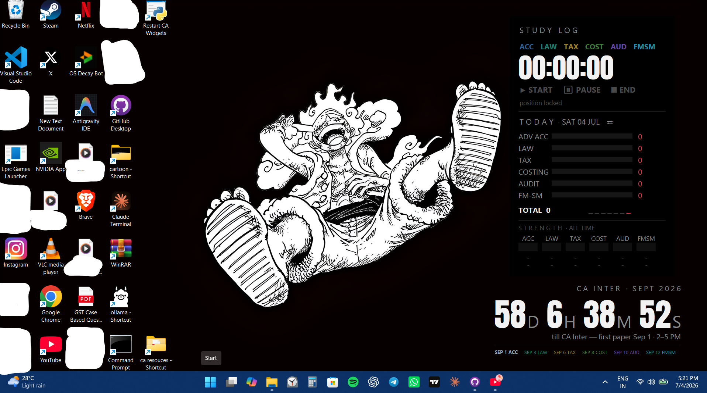

# Study Desktop Widgets

Two tiny Windows desktop widgets that live **on your wallpaper** — behind
every app, in front of the desktop icons — built with plain Python/tkinter.
No Electron, no browser engine, ~30 MB RAM total.

- **Study Logger** — pick a subject, run a stopwatch, every session is
  logged. Glance views: today's bars per subject, a 14-day heatmap, an
  all-time strength strip, and urgency colours that tell you *what to study
  next* (red = neglected, white = ahead).
- **Exam Countdown** — big live countdown to your next paper, heat-coloured
  digits as the day approaches, full schedule strip with each paper in its
  subject's colour.

**Works for any student, any stream.** The first launch pops a setup window
where you type your own subjects / exam dates — nothing is hard-coded. Your
answers are saved to a small JSON file next to the script, and you can
re-open that editor anytime with `--setup`.

## Screenshots

**Study Logger** — subject bars, 14-day heatmap, urgency strip:



**Exam Countdown** — heat-coloured live countdown + schedule strip:



**Both, pinned to the wallpaper behind every app:**



<!-- Want a shot of the setup popup too? Run a widget once, screenshot the
     window that appears, save it as assets/setup.png and link it here. -->

---

# Install & run — the few-clicks version (for non-coders)

You don't need to know any Python. Three one-time steps, then you double-click
a file.

### 1. Install Python (once, ~2 minutes)

1. Go to **<https://www.python.org/downloads/windows/>** and download the
   latest **Windows installer** (Python **3.11 or newer**).
2. Run the installer. On the very first screen, **tick the box that says
   "Add python.exe to PATH"** (bottom of the window) — this matters.
3. Click **Install Now**, wait, then **Close**.

That's everything. The widgets only use Python's built-in parts (the
graphics library `tkinter` ships inside that installer), so there is nothing
else to install — no `pip install`, no internet after this.

### 2. Download these widgets

- On the GitHub page, click the green **`Code`** button → **Download ZIP**.
- **Right-click the downloaded ZIP → Extract All…** into any folder you like,
  e.g. `Documents\Study_Widgets`.
- (If you know git: `git clone` the repo instead.)

### 3. Start a widget (double-click)

Open the extracted folder and **double-click**:

| Widget | File to double-click |
|---|---|
| Study Logger | `study_logger` → `study_logger_widget.pyw` |
| Exam Countdown | `countdown` → `ca_countdown_widget.pyw` |

`.pyw` files run **silently** (no black console window) — that's normal. The
**first time**, a small dark **setup window pops up** (see next section). Fill
it in and hit **SAVE & LAUNCH**.

After it launches, the widget pins itself *behind* your apps. **Press
`Win + D`** (show desktop) to see and click it.

> **Nothing happened when I double-clicked?** Windows may not have linked
> `.pyw` files to Python. Fix: right-click the file → *Open with* → choose
> **Python**. Or run it from a terminal (see
> [Running from a terminal](#running-from-a-terminal-optional) below).

---

# The setup popup — first launch (and how to reopen it)

The **first time** you run each widget (i.e. before its config file exists),
it opens a setup window. Type your own details, press the red
**`SAVE  &  LAUNCH`** button, and the widget starts. Your answers are written
to a JSON file *next to the script* so you never see the popup again — unless
you ask for it.

**Reopen the editor anytime** to change your subjects/exams — see
[Change your setup later](#change-your-setup-later).

### Study Logger setup

```
┌──────────────────────────────────────────────┐
│  SET UP YOUR STUDY LOG                        │
│                                               │
│  widget title      [ STUDY LOG            ]   │
│                                               │
│  your subjects (2–8) — full name + short      │
│  chip label, leave rows blank to skip         │
│  [ Advanced Accounting        ]  [ ACC   ]    │
│  [ Corporate & Other Laws     ]  [ LAW   ]    │
│  [ Taxation                   ]  [ TAX   ]    │
│  [ ...                        ]  [ ...   ]    │
│                                               │
│          [  SAVE  &  LAUNCH  ]                │
└──────────────────────────────────────────────┘
```

- **widget title** — the small header shown on the widget (e.g. `STUDY LOG`,
  `NEET PREP`). Optional; a default is used if blank.
- **Each subject needs both a full name and a short chip.** The *chip* is the
  little button label on the widget (auto-uppercased, up to 6 letters, e.g.
  `PHY`, `BIO`, `MATH`). **Chips must be unique.**
- Enter **2 to 8 subjects**. Leave any leftover rows blank.
- Each subject is auto-assigned its own deep colour, in the order you list
  them.

Saved to **`study_logger/subjects.json`**.

### Exam Countdown setup

```
┌───────────────────────────────────────────────────────────┐
│  SET UP YOUR EXAM COUNTDOWN                                │
│                                                           │
│  header line (e.g. CBSE XII · MARCH 2027)  [ ...        ] │
│  short name ("till <this> ...")            [ boards    ] │
│  leave-home time, 24h HH:MM                [ 13:30     ] │
│  exam hours text (e.g. 2–5 PM)             [ 2–5 PM    ] │
│                                                           │
│  papers (1–8): date + full name + short chip              │
│  date (YYYY-MM-DD)   paper / subject name        chip     │
│  [ 2027-03-01 ]      [ English            ]     [ ENG ]   │
│  [ 2027-03-04 ]      [ Physics            ]     [ PHY ]   │
│  [ ...        ]      [ ...                ]     [ ... ]   │
│                                                           │
│                 [  SAVE  &  LAUNCH  ]                     │
└───────────────────────────────────────────────────────────┘
```

- **header line** — the big letter-spaced title on the widget
  (e.g. `CA INTER · SEPT 2026`).
- **short name** — a couple of words used inside the sentence *"…till **this**
  — first paper in …"* (e.g. `boards`, `CA Inter`).
- **leave-home time (HH:MM, 24-hour)** — the countdown targets *when you leave
  for the hall*, not the paper's start. `13:30` = 1:30 PM. Must look like
  `HH:MM`.
- **exam hours text** — free text shown in the sub-line (e.g. `2–5 PM`), just
  for display.
- **papers (1–8)** — one row per paper: **date as `YYYY-MM-DD`**, the full
  subject name, and a short **chip** (uppercased, ≤6 chars, **unique**). Leave
  extra rows blank.

Saved to **`countdown/countdown_config.json`**. The countdown then switches
states on its own: counts down to the next paper, highlights it red on exam
day, and shows **`DONE.`** after the last one.

> **Made a typo?** The popup checks your entries and shows a red message (e.g.
> *"chip 'PHY' is used twice"* or *"bad date — use YYYY-MM-DD"*) instead of
> saving. Fix it and press SAVE again.

---

# Everyday use

### Study Logger

1. **Click a subject chip** — it turns red (selected).
2. **▶ START** — the big timer runs, a red dot pulses.
3. **⏸ PAUSE / ▶ RESUME** — break time is never counted.
4. **■ END** — the session is saved. Sessions under 30 seconds are discarded.
   You can't switch subjects mid-session — END first (keeps the log honest).
5. **Click the panel header** to flip the lower view between **TODAY** (a bar
   per subject + 7-day sparkline) and **LAST 14 DAYS** (a heatmap). The
   always-visible bottom **STRENGTH** strip shows your all-time balance.

**The colours mean "what to study next."** A subject is compared to your
average subject over a window and turns **red** when it's under ⅔ of that
average (neglected), **orange** when it's slipping, and **white** when you're
ahead and can ease off. (Nothing screams red on day one — a window is only
judged after ~2 hours of data land in it.)

### Exam Countdown

- Shows a live **days / hours / minutes / seconds** countdown to your next
  paper's leave-home time, ticking every second.
- The **digits change colour with urgency**: white → orange (≤15 days) →
  reddish-orange (≤7 days) → deep red (≤24 hours).
- The **schedule strip** lists every paper in its own colour: next paper is
  bright, exam-day is red, finished papers are struck through.

### Move, resize, and quit

| Action | How |
|---|---|
| **Move** | **Double-click a blank spot** (border turns red) → drag anywhere → double-click again to lock. |
| **Resize** (Study Logger) | In that same red-border mode, **drag a corner** — the whole widget scales uniformly, fonts and all (0.6×–2×). |
| **Quit** | **Right-click** the widget. A running Study Logger session is ended and **saved first** — nothing is lost. |

Position and scale are remembered in `widget_state.json`, so the widget comes
back exactly where you left it.

---

# Make them start automatically with Windows

So the widgets are always on your wallpaper after every restart — no
double-clicking. This uses the **Startup folder**, a special folder Windows
launches everything inside at login.

### The easy way (shortcuts in the Startup folder)

For **each** widget file (`study_logger_widget.pyw`, then
`ca_countdown_widget.pyw`):

1. **Right-click** the `.pyw` file → **Create shortcut** (on Windows 11 it may
   be under *Show more options*). A shortcut file appears.
2. Press **`Win + R`**, type **`shell:startup`**, press Enter. This opens your
   personal Startup folder.
3. **Drag the shortcut** into that folder.

Repeat for the second widget. Done — both launch silently at every login.
Because each widget has a **single-instance lock**, launching one while it's
already running just exits quietly, so this is safe.

**To stop auto-start:** delete that shortcut from the `shell:startup` folder.

### The explicit way (if you prefer a precise target)

Make a shortcut whose **Target** is `pythonw.exe` followed by the full path to
the `.pyw`, e.g.:

```
"C:\Users\you\AppData\Local\Programs\Python\Python312\pythonw.exe" "C:\...\study_logger\study_logger_widget.pyw"
```

then drop it in `shell:startup`. (`pythonw.exe` sits next to `python.exe` in
your Python install folder; using it guarantees no console window flashes.)

---

# Change your setup later

Ran it once and want different subjects, exams, or dates? Reopen the same
setup popup from a terminal (see below) — this **doesn't** wipe your logged
study time, it only rewrites the subject/exam list:

```
python study_logger/study_logger_widget.pyw --setup
python countdown/ca_countdown_widget.pyw --setup
```

You can also just edit `subjects.json` / `countdown_config.json` by hand — they
are plain, readable JSON.

---

# Your data (where it lives, backing up)

Everything stays **local, next to each script**, and is kept **out of git**
(listed in `.gitignore`):

| File | What it holds | Safe to delete? |
|---|---|---|
| `study_logger/study_log.jsonl` | **Your study history** — one JSON line per session. | **No — this is your data. Back it up.** |
| `study_logger/subjects.json` | Your Study Logger setup (subjects, title). | Yes (re-runs the setup popup). |
| `countdown/countdown_config.json` | Your exam schedule. | Yes (re-runs the setup popup). |
| `*/widget_state.json` | Remembered position / scale / active view. | Yes (resets to default position). |
| `study_logger/active_session.json` | Crash-safety checkpoint; exists only while a session runs. | Yes (auto-cleaned). |

`study_log.jsonl` is append-only plain text — easy to copy to a backup, open
in Excel, or load into pandas/polars later. Example line:

```json
{"subject": "Tax", "date": "2026-07-04", "start": "2026-07-04T10:36:42", "end": "2026-07-04T12:06:42", "sec": 5400}
```

**Crash safety:** while a session runs, progress is checkpointed every 30 s. If
the PC dies mid-session, the next launch banks the time up to the last
checkpoint (marked `"recovered": true`). You basically can't lose study time.

---

# Troubleshooting

| Problem | Fix |
|---|---|
| **Can't see the widget** | It's *behind* your apps by design. Press **`Win + D`** (show desktop). |
| **Widget looks stuck / frozen / invisible** | Run **`restart_widgets.pyw`** (double-click it) — it silently kills and relaunches **both** widgets. A plain relaunch wouldn't work because of the single-instance lock; this handles that. |
| **Double-clicking the `.pyw` does nothing** | `.pyw` isn't linked to Python. Right-click → *Open with* → **Python**, or run it from a terminal. |
| **Big digits look like a plain bold font** | The Anton font file (`anton.ttf`) must sit next to the `.pyw`. If missing it falls back to Segoe UI Black — still works, just less styled. |
| **I want to see error messages** | Run with `python` (not `pythonw`) from a terminal — a console appears with logs. |

### Running from a terminal (optional)

Open the folder, click the address bar, type `cmd`, press Enter (or use
PowerShell / Windows Terminal), then:

```
pythonw study_logger\study_logger_widget.pyw      silent, normal use
python  study_logger\study_logger_widget.pyw      with a console, for debugging
python  study_logger\study_logger_widget.pyw --preview   normal top-most window, for testing
```

The Exam Countdown supports the same, plus previewing a future moment and
saving a screenshot:

```
python countdown\ca_countdown_widget.pyw --now 2026-09-05T10:00    preview a future state
python countdown\ca_countdown_widget.pyw --shot out.png           save a screenshot and exit
```

---

# How it works (the fun part)

Pinning a window to the wallpaper layer on Windows 11 hides two nasty traps
we hit and documented:

1. **A reparented window never repaints until its size changes once.**
   `RedrawWindow`, forced repaints, moves — nothing works. The widgets do a
   one-shot 1-pixel resize "jiggle" after pinning; after that, paints flow
   normally.
2. **The desktop-icons layer (`SHELLDLL_DefView`) eats every mouse click**
   aimed at the classic wallpaper `WorkerW`, so a widget parented there can
   never be interactive. These widgets parent into **Progman** and raise
   themselves above the icons layer instead — still behind all apps, but
   clickable.

The full debugging story (bisecting with `PrintWindow` pixel oracles,
FreeType ink measurements for cropped digit tops, etc.) is in
[study_logger/GOAL.md](study_logger/GOAL.md) and the two `upgrades.md`
changelogs.

# Files

| path | what |
|---|---|
| `study_logger/study_logger_widget.pyw` | the study logger widget (one file) |
| `countdown/ca_countdown_widget.pyw` | the exam countdown widget (one file) |
| `restart_widgets.pyw` | silent kill-and-relaunch for both |
| `*/anton.ttf` | Anton font for the big digits (SIL OFL — see [FONT_LICENSE.md](FONT_LICENSE.md)) |
| `*/README.md`, `*/upgrades.md`, `*/folderuse.md` | per-widget docs + changelogs |
| `assets/` | screenshots |

Your personal data (`study_log.jsonl`, `subjects.json`,
`countdown_config.json`, `widget_state.json`, `active_session.json`) stays
local and is gitignored.

# License

Code: MIT (see [LICENSE](LICENSE)). Anton font by Vernon Adams, SIL Open
Font License 1.1 (see [FONT_LICENSE.md](FONT_LICENSE.md)).
